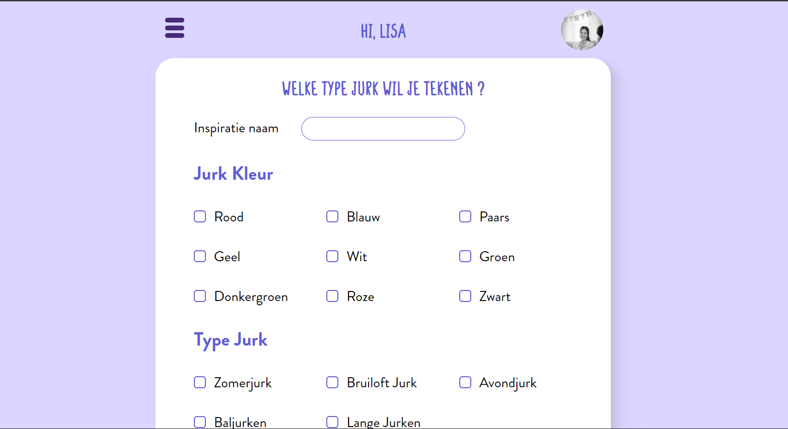
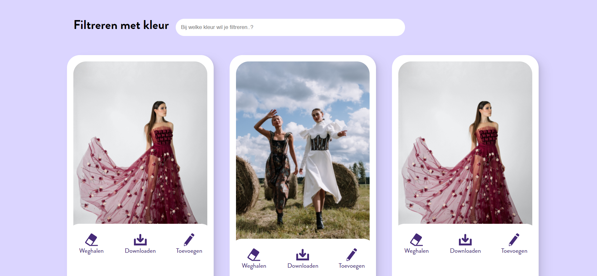
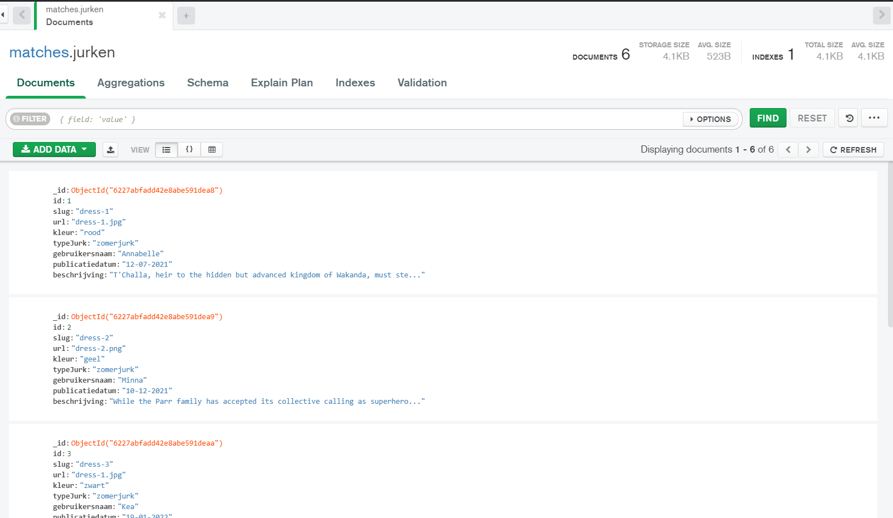

# :dress: Dresses matching app :dress:
Voor blok tech had ik een applicatie ontwikkeld voor kunstenaars die inspiratie zoeken om jurken te tekenen. De applicatie werkt als volgende: Door middel van een formulier, vul je je voorkeuren voor de jurk in. Hiermee krijg je aantal matches die passend zijn op jouw keuzes.

 <br>



## Feature - Zoekopdracht
De belangrijkste functionaliteit van deze applicatie is data krijgen op basis van een zoekopdracht.  De feature is gebaseerd op een [job story](https://github.com/K3A101/Tech-matching-app/wiki/Requirements-lijst) en [enkele eisen](https://github.com/K3A101/Tech-matching-app/wiki/Requirements-lijst).

De gebruikers moet een formulier invullen met de voorkeuren van de jurk. Daarna wordt de resultaten getoond.

Wanneer de gebruiker een match vindt en opslaat, kunnen  de afbeeldingen aangepast worden voor het tekenen. Bijvoorbeeld kleurpallette halen uit de afbeelding en afbeelding vergroten.

---

## Applicatie installeren :

#### Nodig:
- Node.js
- Npm
- Express  
- Mongodb Atlas en Mongodb Compass
- Ejs template engine


#### 1. Clone dit repository 
`git clone https://github.com/K3A101/Tech-matching-app.git`

#### 2. Npm packages installeren
Om packages te installeren gebruik je `npm install`

#### 3. Server starten 
Om de server te starten je de volgende commando gebruiken:
```bash
npm run deploy
# nodemon server.js 
``` 
 Ik heb de npm package nodemon gebruikt om de server makkelijk te herstarten. Het package wordt geinstalleerd 
 `npm install --save-dev nodemon`

---
## Live demo van de applicatie

Hier is een live demo van de matching applicatie: [https://jurk-matching-app.herokuapp.com/](https://jurk-matching-app.herokuapp.com/).
 
 --- 
 ## Database 
 Ik geef hier de stuk van de database aan. Hiermee kunt u een structuur van de database namaken. 

 <br>

 Voor meer details kunt u verder lezen in mijn [wiki documentatie](https://github.com/K3A101/Tech-matching-app/wiki).

 ---
## MIT Licentie
Voor dit project heb ik gebruikt gemaakt van de MIT licence. 

> Ik heb de license MIT gebruikt. Want het is veel gebruikt, en heeft een kort en krachtige terms and conditions. Verder wordt het gebruikt als een project npm packages bevat. Die ga ik aan de slag tijdens backend.

 ---
 ### Bronnen
 - Codecademy. (z.d.). Learn JavaScript: Introduction cheatsheet. Geraadpleegd op 10 maart 2022, van https://www.codecademy.com/learn/introduction-to-javascript/modules/learn-javascript-introduction/cheatsheetInstalling 

 - Express. (z.d.). Express. Geraadpleegd op 10 maart 2022, van https://expressjs.com/en/starter/installing.html
 
 - Markdown cheat sheet | markdown guide. (z.d.). Markdown Guide. Geraadpleegd op 10 maart 2022, van https://www.markdownguide.org/cheat-sheet/

 - Npm: Nodemon. (2021, 9 november). Npm. Geraadpleegd op 10 maart 2022, van https://www.npmjs.com/package/nodemonSev, C. (2021, 5 mei).
 
- How to use EJS to template your node application. DigitalOcean Community. Geraadpleegd op 10 maart 2022, van https://www.digitalocean.com/community/tutorials/how-to-use-ejs-to-template-your-node-applicationSmith, O. (2019, 23 juli).

- GIT push and pull tutorial. DataCamp Community. Geraadpleegd op 10 maart 2022, van https://www.datacamp.com/community/tutorials/git-push-pullThe 

- Net Ninja. (2020, 15 juni). Node.js Crash Course Tutorial #1 - Introduction & Setup [Video]. YouTube. https://www.youtube.com/watch?v=zb3Qk8SG5Ms&list=PL4cUxeGkcC9jsz4LDYc6kv3ymONOKxwBU&ab_channel=TheNetNinja
