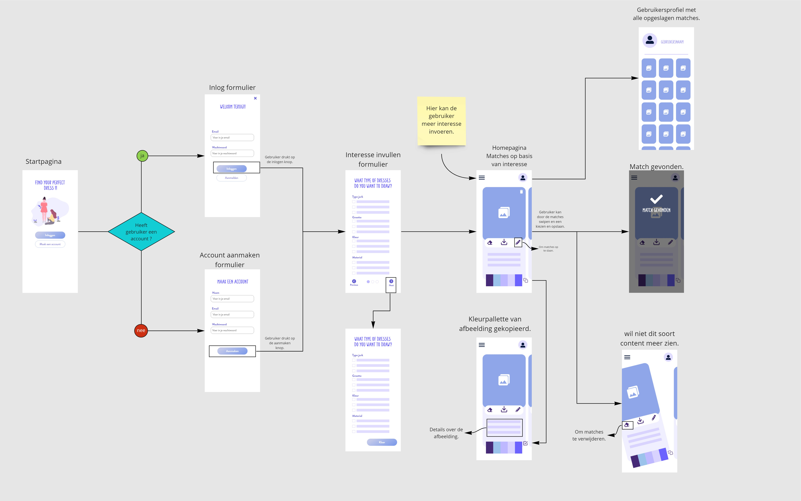

# Het interface van de applicatie
Ik heb voor mijn concept een wireframe gemaakt om te laten zien hoe de applicatie uitziet. Verder heb ik een flowchart in de wireframe toegepast om te laten zien hoe de gebruiker de applicatie kan gebruiken. 

## Wireflow
Op de schermen zit er niet heel erg gedetailleerd. Het is gewoon bedoeld om te kijken hoe het structuur is en de flow te laten zien. 

> Hier is een [Miro Link](https://miro.com/app/board/uXjVOOeMBfI=/?invite_link_id=804729562952) om  de afbeeldingen beter te zien. 

## Huisstijl voor de Matching applicatie

**Kleur pallette**

**Typografie**

**Iconen**

**Afbeeeldingen**

